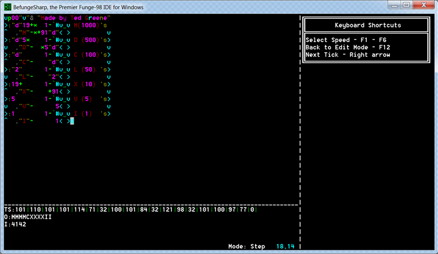

BefungeSharp - The Premier Funge-98 IDE for Windows
===================================================
BefungeSharp is a Funge-98 IDE that aims to have the best Befunge code editor, a fully compliant interpreter, and useful debugging features like edit and continue, all while being very easy to use!

=========================

Be sure to read the "4 Minute Intro" if you are unfamiliar with Befunge.

 
 If you are running on Windows 10, you will likely need to turn on "Legacy Command Prompt", and possibly run the program in compatability mode. Expect some graphical glitches as the console refresh timing is different on newer computers.

Why does this need to exist?
============================
This project fills the void for Windows users who want to quickly get started with Funge-98 (not just Befunge-93,) without complex compilation, and, most of all, want to see the IP dance around FungeSpace. In addition, the Funge specific editor makes writing Funge code much more enjoyable than using Notepad. No other Funge tool combines these features.

Where is the project at right now?
==================================

Completed Features
------------------
* Editor
	- [x] Type in any cardinal direction!
	- [x] Edit and view ALL of FungeSpace (yes, even the negative parts!)
	- [x] Windows clipboard integration
	- [x] Insert code snippets
	- [x] Auto save feature
	- [x] Sidebar with ASCII and keyboard shortcuts reference
	- [x] CMD-like interface for editor file I/O
* Interpreter
	- [x] Visualizes FungeSpace and all active IPs!
	- [x] FungeSpace is Funge-98 compliant
	- [x] HRTI and other fingerprints are supported
	- [x] Implemented i, o, t, =, y, {, and } instructions
	- [x] Switch among step, slow - fast speeds, and output only view
	- [x] Sandbox mode for i, o, and = instructions
	- [x] Befunge-93 compatibility mode
* Debugging
	- [x] Stack, input, and output information displayed
	- [x] Shows FungeSpace change in real time
* Other features
	- [x] Works out of the box, no make files or downloading dependencies!
	- [x] Customizable syntax highlighting throughout program
	- [x] Built in options editor
	- [x] Very colorful menus
	- [x] Entirely open source
	- [x] Does not alter cmd.exe settings
	- [X] A properly chosen open source license (the unlicense)
	
Planned features
----------------
* Editor
	- [ ] Undo and redo program states
	- [ ] Insert mode
	- [ ] "Tool chain" feature to open current source file in other interpreters
	- [ ] "Reverse selection in place" feature
	- [ ] "Rotate selection" feature
* Interpreter
	- [ ] Trefunge support
	- [ ] Better performance
	- [ ] Logging output to files
	- [ ] 'y' instruction fully compliant
* Debugging
	- [ ] Edit and Continue mode
	- [ ] Command line debugging
* Help
	- [ ] A full list of keyboard short cuts and program help
	- [ ] Implementation notes
	- [ ] Full language reference and tutorials
	- [ ] Partial 'y' read out
* Other features
	- [ ] Add use of command line arguments
	- [ ] Using MonoGame for graphics and input instead of (cleverly) twisting the console's intended usage
	- [ ] An even more awesome icon for the program

System Requirements
-------------------
.NET Framework 4.5 Runtime Libraries, Visual Studio 2012 or greater for compiling.

Please enjoy, and if you'd really like to be a pal send the author a bug report or a comment about it!
